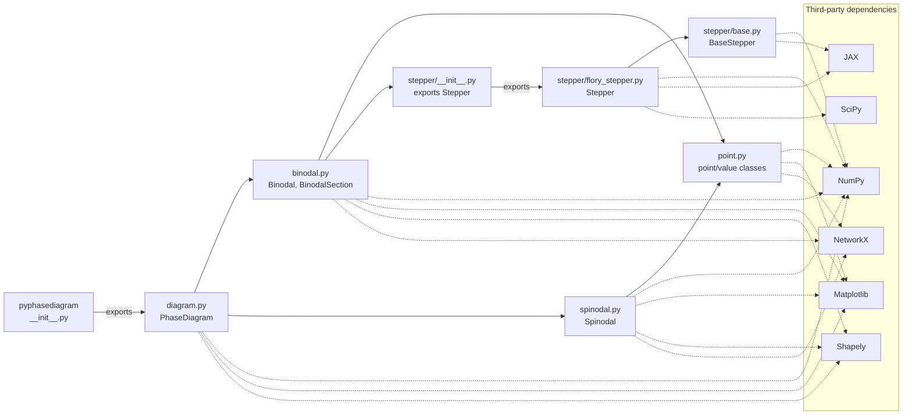
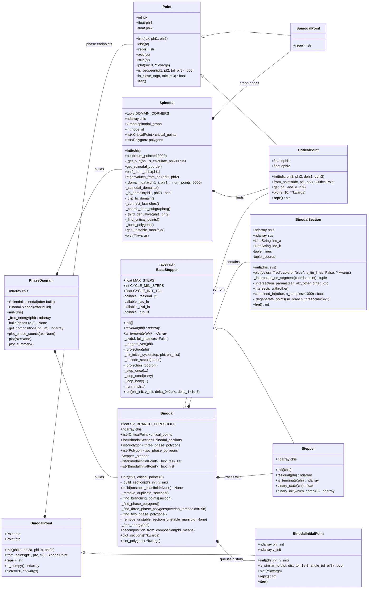

This document was created with AI assistance and only serves as a reference for the package architecture.
# `pyphasediagram` package architecture

This document describes the modules under `src/pyphasediagram`. The diagrams use
[Mermaid](https://mermaid.js.org/) and render directly in GitHub and many Markdown
viewers.

## Module dependencies

Solid arrows are internal imports. Dashed arrows point to third-party packages.
The two package `__init__.py` files form the public import paths shown at the top.



## Classes, attributes, and methods

`+` denotes public API, `-` denotes an internal implementation detail, and `{static}`
or `{abstract}` describes special methods. Attributes marked "after build" are added
by `build()` rather than by the constructor.



## Main build flow

```mermaid
flowchart TD
    start["PhaseDiagram(chis)"] --> build["PhaseDiagram.build()"]
    build --> spinodal_create["Create Spinodal"]
    spinodal_create --> spinodal_build["Spinodal.build()"]
    spinodal_build --> graph["Construct spinodal graph and polygons"]
    graph --> critical["Find CriticalPoint objects"]
    critical --> binodal_create["Create Binodal with critical points"]
    binodal_create --> manifold["Get unstable manifold from Spinodal"]
    manifold --> binodal_build["Binodal.build(unstable_manifold)"]
    binodal_build --> seeds["Seed from binary limits and critical points"]
    seeds --> trace["Stepper.run() traces coexistence sections"]
    trace --> branch["Detect and queue branch points"]
    branch --> clean["Remove unstable and duplicate sections"]
    clean --> polygons["Build two- and three-phase polygons"]
    polygons --> ready["Diagram ready for plotting/decomposition"]
```

## Reading guide

- `diagram.py` is the facade: start with `PhaseDiagram.build()` and its plotting
  methods.
- `spinodal.py` finds instability boundaries and critical points.
- `binodal.py` traces coexistence curves, detects intersections, and builds the
  two- and three-phase regions.
- `stepper/base.py` contains the generic JAX predictor/projector loop;
  `stepper/flory_stepper.py` supplies the Flory-Huggins residual and initialization.
- `point.py` provides the small point and initialization objects shared by the
  spinodal and binodal calculations.

